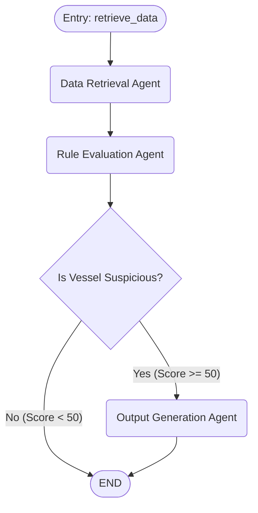

# Autonomous Agents & Reasoning Layer

This directory contains the LangGraph workflow and the Model Context Protocol (MCP) server for the Maritime AI Framework (Engineer B's domain).

## Architecture overview

We employ a modular, graph-based agentic architecture to process incoming vessel data.

### 1. LangGraph Orchestrator (`graph.py` & `state.py`)
LangGraph is used to orchestrate a deterministic, multi-agent state machine. State is passed between nodes via the `AgentState` TypedDict.



#### The Agents
*   **Data Retrieval Agent**: Interfaces with the raw data ingestion layer (Kafka/NiFi endpoints) to pull historical context.
*   **Rule Evaluation Agent (The Critic)**: Evaluates the raw data against complex rules and the Neo4j Knowledge Graph. Assigns an *Evasion Risk Score (0-100)*.
*   **Output Generation Agent**: An LLM (e.g., OpenAI) that takes the anomaly flags and synthesizes them into a human-readable Suspicious Activity Report (SAR). This node is *only* triggered if the risk score exceeds a threshold, saving LLM tokens on safe vessels.

### 2. Model Context Protocol Server (`mcp_server.py`)
To expose our specific Python/Neo4j tool logic (like the `SanctionScorer`) to any LLM runtime, we wrap it in a lightweight FastMCP server. This means Claude Desktop, Cursor, or LangChain agents can dynamically discover and execute our maritime graph queries.

## Getting Started

### Prerequisites
Ensure your virtual environment is active and all dependencies in the root `requirements.txt` are installed.

### Run the MCP Server
To start the MCP server locally using stdio (which MCP clients connect to):
```bash
python mcp_server.py
```

### Run the LangGraph Pipeline
To execute a test run of the multi-agent workflow against the dummy database:
```bash
python graph.py
```

## Best Practices for Modular AI Pipelines
1.  **State is Immutable**: Always return a delta update from your LangGraph nodes; never mutate the `state` dictionary directly.
2.  **Save LLM Tokens**: Use cheap deterministic rules (like Neo4j Cypher queries or Python heuristics) to filter out "noise" *before* invoking an LLM. 
3.  **Human-in-the-loop**: For high-risk SAR generation, LangGraph allows adding a `breakpoint` before the `END` node, pausing execution until a human analyst approves the report.
