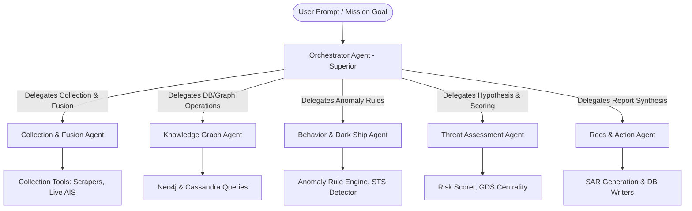

# Autonomous Agents & Reasoning Layer (Agent Zero AI)

This directory contains the capability-centric multi-agent reasoning layer and the Model Context Protocol (MCP) server for the Maritime AI Framework (Engineer B's domain), graduated from LangGraph to **Agent Zero AI**.

## Architecture Overview

We employ a modular, capability-centric multi-agent architecture to process incoming vessel observations. This design aligns with the DRDO framework: agents are organized around **capabilities** rather than sensors, ensuring seamless scalability when new sensor feeds are added.


```mermaid
graph TD
    User([User Prompt / Mission Goal]) --> Orchestrator[Orchestrator Agent - Superior]
    
    Orchestrator -->|Delegates Collection & Fusion| CF_Agent[Collection & Fusion Agent]
    Orchestrator -->|Delegates DB/Graph Operations| KG_Agent[Knowledge Graph Agent]
    Orchestrator -->|Delegates Anomaly Rules| BD_Agent[Behavior & Dark Ship Agent]
    Orchestrator -->|Delegates Hypothesis & Scoring| TA_Agent[Threat Assessment Agent]
    Orchestrator -->|Delegates Report Synthesis| RA_Agent[Recs & Action Agent]

    %% Tools mappings
    CF_Agent --> CF_Tools[Collection Tools: Scrapers, Live AIS]
    KG_Agent --> KG_Tools[Neo4j & Cassandra Queries]
    BD_Agent --> BD_Tools[Anomaly Rule Engine, STS Detector]
    TA_Agent --> TA_Tools[Risk Scorer, GDS Centrality]
    RA_Agent --> RA_Tools[SAR Generation & DB Writers]
```

### The Capability Agents:
1. **Orchestrator Agent (Superior):** Handles mission planning, goal decomposition, sub-task allocation, and final results synthesis.
2. **Collection & Fusion Agent (Subordinate):** Gathers raw sensor and registry observations (MarineTraffic, Equasis) and fuses them into a unified vessel state.
3. **Knowledge Graph Agent (Subordinate):** Queries and updates entity and event nodes/relationships in the Neo4j Knowledge Graph.
4. **Behavior & Dark Ship Agent (Subordinate):** Runs rule engines to detect GPS speed spoofing, transponder gaps, bathymetric draft plausibility, and loitering rendezvous (Ship-to-Ship transfers).
5. **Threat Assessment Agent (Subordinate):** Computes aggregate evasion risk scores (0-100), extracts risk flags, and evaluates betweenness centrality.
6. **Recommendation & Action Agent (Subordinate):** Generates human-readable Suspicious Activity Reports (SAR) and saves them in the database.

---

## File Structure

*   `agent_zero_orchestrator.py`: The main entry point initializing and running the superior-subordinate coordination loop.
*   `agent_zero_config.py`: Profiles, model properties (using Groq Llama-3 models), and system instructions.
*   `agent_zero_tools.py`: Modular Python functions mapped as tools for capability-centric execution.
*   `mcp_server.py`: Wraps our custom Neo4j scorer in a FastMCP server, allowing other external agent frameworks to discover and execute our tools.

---

## Getting Started

### Prerequisites

Ensure your virtual environment is active and all dependencies in the root `requirements.txt` are installed:
```bash
pip install -r requirements.txt
```

Verify your `.env` file contains your configuration. You can switch between Groq (online/cloud) and Ollama (offline/local) using the `LLM_PROVIDER` toggle:

#### Online Option (Groq):
```env
LLM_PROVIDER="groq"
GROQ_API_KEY="your-groq-key-here"
```

#### Offline/Local Option (Ollama):
1. Make sure Ollama is running locally on `http://localhost:11434`.
2. Pull your local models, e.g.: `ollama pull llama3:8b`.
3. Configure your `.env`:
```env
LLM_PROVIDER="ollama"
OLLAMA_API_BASE="http://localhost:11434/v1"
OLLAMA_ORCHESTRATOR_MODEL="llama3:8b" # (Or llama3:70b if high-end local GPU is available)
OLLAMA_SUBORDINATE_MODEL="llama3:8b"
```

### Run the Agent Zero Orchestrator

To execute a test run of the multi-agent reasoning flow against the active database:
```bash
python agents/agent_zero_orchestrator.py
```
This runs the orchestrator in a superior-subordinate loop. It will output a reasoning log demonstrating capability delegation and tool usage for both safe and suspicious vessels.

### Run the MCP Server

To start the MCP server locally using stdio (which MCP clients connect to):
```bash
python agents/mcp_server.py
```
