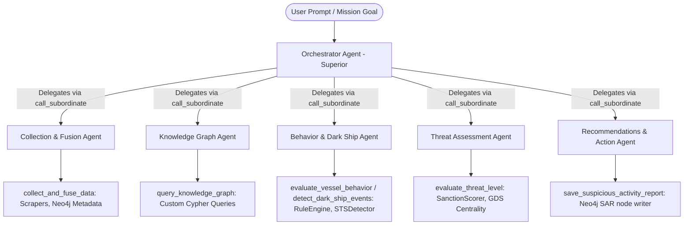

# Autonomous Agents and Reasoning Layer (Agent Zero AI)

This directory contains the capability-centric multi-agent reasoning layer and the Model Context Protocol (MCP) server for the Maritime AI Framework. The architecture has transitioned from a rigid LangGraph pipeline to a dynamic, hierarchical multi-agent coordination layer powered by Agent Zero AI.

---

## Transition from LangGraph to Agent Zero

The project has transitioned from a linear LangGraph pipeline to a dynamic Agent Zero AI architecture to support more flexible reasoning patterns:
*   **Dynamic Task Routing:** Instead of utilizing hardcoded routing edges, the superior Orchestrator Agent dynamically plans, decomposes, and delegates sub-tasks to specialized subordinate agents based on the query.
*   **Multi-Turn Agent Reasoning:** Agents execute iterative inner reasoning loops (encompassing Observation, Thought, Action, and Result steps) using LangChain tool bindings.
*   **Hierarchical Agent Spawning:** The Orchestrator spawns subordinate agents dynamically using a recursive delegation pattern via the `call_subordinate` tool.

---

## Architecture Overview

The multi-agent system uses a hierarchical Superior-Subordinate delegation design. Subordinate agents are organized around specific capabilities rather than individual sensors, aligning with the project's core framework requirements. This abstraction ensures that new sensor feeds or ingestion layers can be integrated without modifying the core agent coordination flow.


```mermaid
graph TD
    User([User Prompt / Mission Goal]) --> Orchestrator[Orchestrator Agent - Superior]
    
    Orchestrator -->|Delegates via call_subordinate| CF_Agent[Collection & Fusion Agent]
    Orchestrator -->|Delegates via call_subordinate| KG_Agent[Knowledge Graph Agent]
    Orchestrator -->|Delegates via call_subordinate| BD_Agent[Behavior & Dark Ship Agent]
    Orchestrator -->|Delegates via call_subordinate| TA_Agent[Threat Assessment Agent]
    Orchestrator -->|Delegates via call_subordinate| RA_Agent[Recommendations & Action Agent]

    %% Tools mappings
    CF_Agent --> CF_Tools[collect_and_fuse_data: Scrapers, Neo4j Metadata]
    KG_Agent --> KG_Tools[query_knowledge_graph: Custom Cypher Queries]
    BD_Agent --> BD_Tools[evaluate_vessel_behavior / detect_dark_ship_events: RuleEngine, STSDetector]
    TA_Agent --> TA_Tools[evaluate_threat_level: SanctionScorer, GDS Centrality]
    RA_Agent --> RA_Tools[save_suspicious_activity_report: Neo4j SAR node writer]
```

### The Capability-Centric Agent Roles
1.  **Orchestrator Agent (Superior):** Coordinates the overall mission. It performs goal decomposition, routes tasks to subordinates using `call_subordinate`, compiles findings, and returns the final assessment to the user.
2.  **Collection & Fusion Agent (Subordinate):** Gathers raw vessel data from parallel online registries (MarineTraffic, Equasis) and fuses them with local database parameters into a unified vessel state.
3.  **Knowledge Graph Agent (Subordinate):** Runs read/write Cypher queries to extract structural and relational context from the Neo4j Graph.
4.  **Behavior & Dark Ship Agent (Subordinate):** Executes the Rule Engine to check for behavioral anomalies (GPS speed spoofing, transponder gaps) and runs spatial-temporal correlation to detect loitering/rendezvous events (Ship-to-Ship transfers).
5.  **Threat Assessment Agent (Subordinate):** Queries the SanctionScorer to calculate the vessel's aggregate evasion risk score (0-100), extracts risk flags, and evaluates Graph Data Science (GDS) betweenness centrality to identify key shadow fleet brokers.
6.  **Recommendation & Action Agent (Subordinate):** Synthesizes analysis findings into a formal Suspicious Activity Report (SAR) and writes it into the Neo4j database as a Report node linked to the target Vessel.

---

## File Structure

*   [agent_zero_orchestrator.py](file:///c:/Users/DHARANIDHARAN/Desktop/Project/Marine/Implementation/Code/agents/agent_zero_orchestrator.py): The main entry point that initializes and executes the hierarchical multi-agent loop, exposing tool wrappers to LangChain.
*   [agent_zero_config.py](file:///c:/Users/DHARANIDHARAN/Desktop/Project/Marine/Implementation/Code/agents/agent_zero_config.py): Contains LLM provider configurations (Groq, OpenAI, Ollama), prompt profiles, system instructions, and tool bindings for each agent.
*   [agent_zero_tools.py](file:///c:/Users/DHARANIDHARAN/Desktop/Project/Marine/Implementation/Code/agents/agent_zero_tools.py): The underlying Python functions that execute backend queries, scraping, rule evaluations, and database mutations.
*   [mcp_server.py](file:///c:/Users/DHARANIDHARAN/Desktop/Project/Marine/Implementation/Code/agents/mcp_server.py): A FastMCP server wrapper that exposes the maritime risk scorer as a standardized tool for external MCP-compatible clients.

---

## Configuration and Environment

The framework dynamically resolves the LLM provider based on the `LLM_PROVIDER` environment variable in your `.env` file. You can toggle between online/cloud endpoints and a fully local/offline installation.

### 1. Online Option: Groq (Default)
Exposes low-latency inference with Llama models.
```env
LLM_PROVIDER="groq"
GROQ_API_KEY="your-groq-api-key"
GROQ_ORCHESTRATOR_MODEL="llama-3.3-70b-versatile"
GROQ_SUBORDINATE_MODEL="llama-3.1-8b-instant"
```

### 2. Online Option: OpenAI
Uses OpenAI's GPT models.
```env
LLM_PROVIDER="openai"
OPENAI_API_KEY="your-openai-api-key"
OPENAI_ORCHESTRATOR_MODEL="gpt-4o"
OPENAI_SUBORDINATE_MODEL="gpt-4o-mini"
```

### 3. Offline/Local Option: Ollama
Runs the entire multi-agent stack locally.
1.  Verify Ollama is running at `http://localhost:11434`.
2.  Pull the required model: `ollama pull llama3:8b`.
3.  Configure your `.env`:
    ```env
    LLM_PROVIDER="ollama"
    OLLAMA_API_BASE="http://localhost:11434/v1"
    OLLAMA_ORCHESTRATOR_MODEL="llama3:8b"
    OLLAMA_SUBORDINATE_MODEL="llama3:8b"
    ```

---

## Execution and Usage

### Running the Orchestrator
To execute the multi-agent threat assessment pipeline, run the orchestrator script:
```bash
python agents/agent_zero_orchestrator.py
```

**How it works:**
1.  It connects to the local Neo4j database (`bolt://localhost:7687`) and queries a target sanctioned vessel (linked via `[:SANCTIONED_BY]`) and a safe commercial vessel for comparison.
2.  If the database is offline, it gracefully falls back to static test vessel IMOs: `9179385` (Suspicious) and `9715751` (Safe).
3.  The Orchestrator executes a recursive multi-agent chain to collect data, analyze anomalies, calculate risk scores, and commit the final SAR reports back to the graph.

### Running the MCP Server
To start the Model Context Protocol (MCP) server over standard input/output (stdio):
```bash
python agents/mcp_server.py
```
This enables MCP clients (such as Claude Desktop, Cursor, or LangChain) to dynamically discover and invoke the `calculate_vessel_evasion_risk` tool on our backend.
